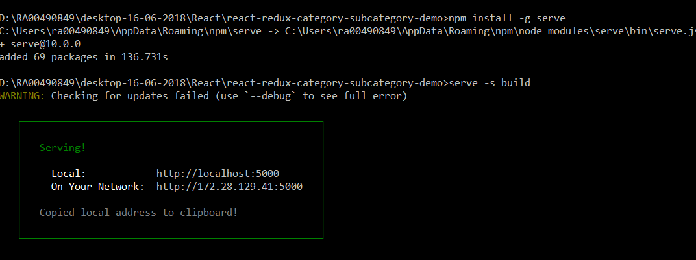

# my-daily-study
Storage of my daily learning


# API Call in React
https://alligator.io/react/axios-react/ <br>
https://jsonplaceholder.typicode.com/users

# Share Data between component in React
https://medium.com/@ruthmpardee/passing-data-between-react-components-103ad82ebd17
https://www.javascriptstuff.com/component-communication/

# Making mock Api 
https://www.mockable.io/ 

# git code commit command
git add . <br>
git commit -m "write comment here" <br>
git push origin <br>

---------------------------------------
git add --all  : for adding all untracked files 

Git pull:when you do a git pull, it gets all the changes from the remote or central repository and attaches it to your corresponding branch in your local repository.
git pull = git fetch + git merge

Git fetch: when you do a git fetch, it gets all the changes from the remote repository, stores the changes in a separate branch in your local repository and if you want to reflect those changes in your corresponding branches, use a git merge to do that.


# mkdir creating problem
when we use mkdir -p src/js/constants it will show error "The syntax of the command is incorrect." (forward slash will give error in windows) <br>
So use backslash it will work in windows like- mkdir -p src\js\constants 

# How can I create an empty .html and .js file in windows command line?
type NUL > test.html <br>
type NUL > test.js

# Deploy build folder on xampp

C:\xampp\tomcat\webapps\build <br>

JSON should be like this before making build <br>

```json
{
  "name": "react-category-subcategory-demo",
  <b>"homepage":"http://localhost:8080/build/",</b>
  "version": "0.1.0",
  "private": true,
  "dependencies": {
    "jquery": "^3.3.1",
    "react": "^16.4.1",
    "react-dom": "^16.4.1",
    "react-scripts": "1.1.4"
  },
  "scripts": {
    "start": "react-scripts start",
    "build": "react-scripts build",
    "test": "react-scripts test --env=jsdom",
    "eject": "react-scripts eject"
  }
}
```

# Deploy code on local node srver and test build

npm install -g serve   <br>
serve -s build  <br>



